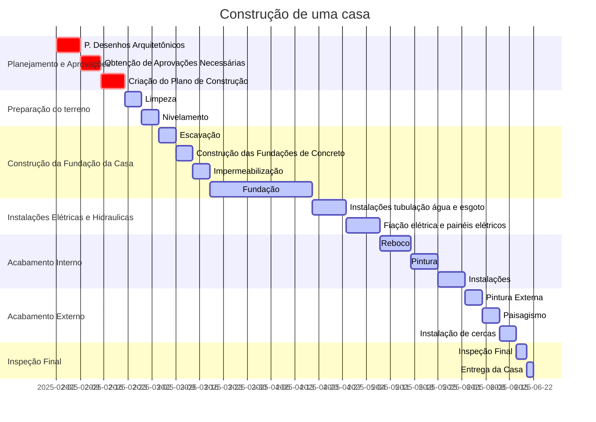

```mermaid
gantt
  title Construção de uma casa
  dateFormat YYYY-MM-DD
    section Planejamento e Aprovações
      P. Desenhos Arquitetônicos:crit, a1, 2025-02-02, 7d
      Obtenção de Aprovações Necessárias:crit, a2, after a1, 6d
      Criação do Plano de Construção:crit, a3, after a2, 7d
    section Preparação do terreno
      Limpeza:active, a4, after a3, 5d
      Nivelamento:active, a5, after a4, 5d
    section Construção da Fundação da Casa
      Escavação:active, a6, after a5, 5d
      Construção das Fundações de Concreto:active, a7, after a6, 5d
      Impermeabilização:active, a8, after a7, 5d
      Fundação:active, a9, after a8, 30d
    section Instalações Elétricas e Hidraulicas
      Instalações tubulação água e esgoto:active, a10, after a9, 10d
      Fiação elétrica e painéis elétricos:active, a11, after a10, 10d
    section Acabamento Interno
      Reboco:active, a12, after a11, 9d
      Pintura:active, a13, after a12, 8d
      Instalações:active, a14, after a13, 8d
    section Acabamento Externo
      Pintura Externa:active, a15, after a14, 5d
      Paisagismo:active, a16, after a15, 5d
      Instalação de cercas:active, a17, after a16, 5d
    section Inspeção Final
      Inspeção Final:active, a18, after a17, 3d
      Entrega da Casa:active, a19, after a18, 2d
```

